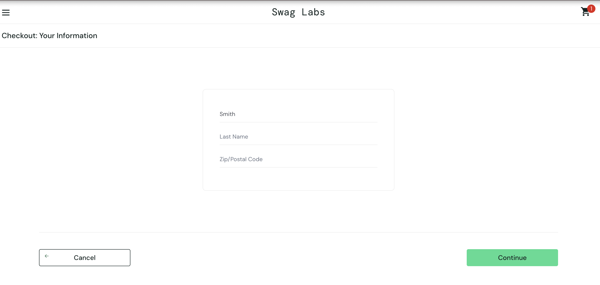

# BUG-001: Last Name input overwrites First Name field at checkout

| Field | Details |
|---|---|
| **Reporter** | Subheksha Pathak |
| **Date** | 2026-09-24 |
| **Environment** | Chrome  154.0.8037.57, macOS 15.7.9 (24G830) |
| **URL** | https://www.saucedemo.com/checkout-step-one.html |
| **User account** | problem_user |
| **Severity** | Major |
| **Priority** | High |
| **Status** | Open |

## Summary
On the checkout information page, typing in the Last Name field
changes the First Name field instead, so the user cannot complete checkout.

## Steps to Reproduce
1. Go to https://www.saucedemo.com
2. Log in with `problem_user` / `secret_sauce`
3. Click "Add to cart" on any product
4. Click the cart icon, then click "Checkout"
5. Type "John" in the First Name field
6. Click the Last Name field and type "Smith"

## Expected Result
First Name shows "John" and Last Name shows "Smith".

## Actual Result
First Name shows "Smith" and Last Name stays empty.
Clicking Continue shows "Error: Last Name is required."

## Screenshot

## Notes
Only reproduces with `problem_user`. `standard_user` works correctly.
